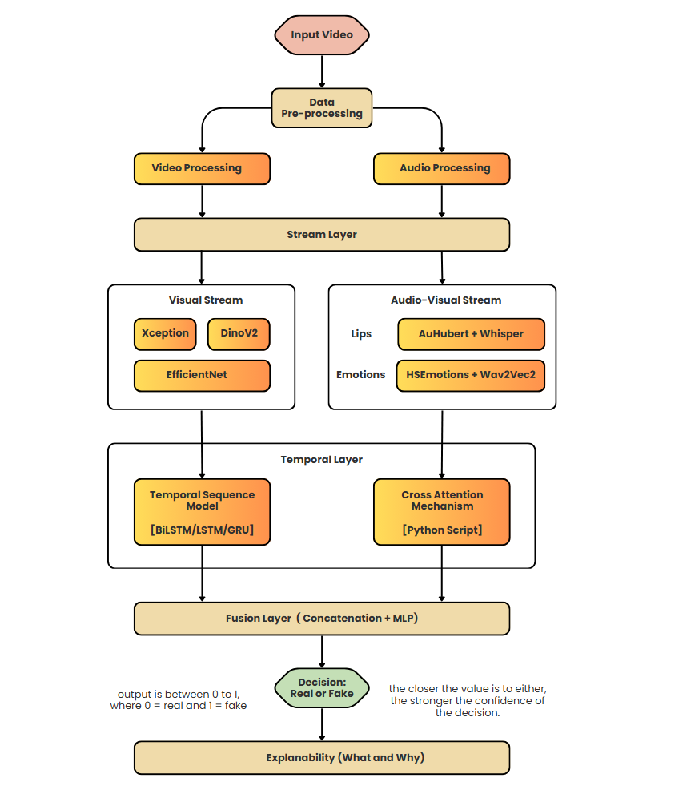

# Audio-Visual Deepfake Detection

Detecting lip-sync deepfakes by checking whether a face and a voice belong to the same event.

A wav2lip forgery repaints the mouth and leaves the rest of the video untouched. Almost every pixel
is genuine, so there is very little manufacturing residue for a vision-only detector to find, and
compression removes most of what there is. What the forgery cannot repair is agreement between the
two tracks: a real recording captures one physical event twice, once as light off a moving mouth and
once as the sound that mouth made, and synthesis breaks the correspondence in a way that survives
compression.

So this detector measures disagreement between modalities rather than asking whether a voice sounds
synthetic. Five streams read one clip, three visual (EfficientNet-B0, Xception, DINOv2) and two
cross-modal (lip-sync, emotion), and each emits an embedding rather than a score. Fusion
concatenates the embeddings and learns from the combination, so it can represent "artifact evidence
is weak but lip-sync mismatch is strong", which is the signature of a lip-sync forgery and something
no average of five scores can express.

<p align="center">
  
</p>

Preprocessing samples 16 timestamps per clip and runs a video path and an audio path over the same
timestamps, so frame *i* and audio window *i* describe the same instant:

```
faces  [16, 3, 224, 224]   ->  visual streams, emotion stream
mouth  [16, 3,  96,  96]   ->  lip-sync stream
audio  [16, 5600]          ->  lip-sync stream, emotion stream
```

The full design, covering architecture, data, tooling, compute assumptions and build order, is in
[docs/PROJECT_OVERVIEW.md](docs/PROJECT_OVERVIEW.md), which is the project's single main document.

## Status

| Component | State |
|---|---|
| Preprocessing | Built. Shared pure functions in `preprocessing/ops/`, called by both the batch pipeline and the dashboard. |
| Manifests and splits | Built. Identity-disjoint splits from `build_splits.py`, verified by `verify_splits.py`. |
| Visual stream module | Built. One config-driven module in `models/streams/common/`; EfficientNet-B0 and Xception wired, DINOv2 not yet. |
| Training | Not written. The streams are defined, but nothing has been trained since the preprocessing rebuild. |
| Lip-sync and emotion streams | Designed, not built (stages 4 and 5). |
| Fusion, evaluation, explainability | Designed, not built (stages 6, 7 and 10). |

An earlier build of the visual stream reached test accuracy 0.963 and AUC 0.994 in-distribution.
Five-point face alignment has since changed the cached pixels, so that is the bar to re-clear rather
than a current result. The pre-rebuild implementation is preserved in commit `926624a`.

## Dataset

Unzip `FakeAVCeleb_v1.2.zip` anywhere under `data/`:

```
data/FakeAVCeleb_v1.2/
├── meta_data.csv
├── RealVideo-RealAudio/
├── RealVideo-FakeAudio/
├── FakeVideo-RealAudio/
└── FakeVideo-FakeAudio/
        └── <race>/<gender>/<identity>/*.mp4
```

The exact location is not hardcoded. Both the pipeline and the dashboard find a dataset by looking
for a `meta_data.csv` under `data/`, so `data/raw/FakeAVCeleb_v1.2/` works equally well and a second
drop can sit alongside the first. `data/*` is gitignored, so the media never enters git.

## Setup

Requires [uv](https://docs.astral.sh/uv/getting-started/installation/). Dependencies are pinned in
`pyproject.toml` and locked in `uv.lock`, so every machine resolves to identical versions.

Pick **exactly one** of the two extras. They install the same torch version from different indexes
and cannot be combined.

```bash
uv sync --extra cpu       # CPU
uv sync --extra cu130     # NVIDIA / CUDA, needs a recent driver
```

Verify a CUDA install with:

```bash
uv run --extra cu130 python -c "import torch; print(torch.cuda.is_available(), torch.cuda.get_device_name(0))"
```

### Running things

`uv sync` creates `.venv`. Activate it once per shell and then use plain `python`:

```bash
.venv\Scripts\activate          # Windows
source .venv/bin/activate       # macOS/Linux
python -c "import torch; print(torch.__version__)"
```

> **Watch out for `uv run`.** If you use it instead of activating, you must pass the extra *every
> single time*: `uv run --extra cu130 python ...`. A bare `uv run python ...` re-syncs the
> environment to the no-extra state, which silently swaps CUDA torch for the CPU build.
> `torch.cuda.is_available()` starts returning `False` and training quietly drops to CPU. Activating
> the venv avoids this, because plain `python` never re-syncs.

To add or change a dependency, edit `pyproject.toml`, run `uv lock`, and commit the updated
`uv.lock`.

PyAV (`av`) bundles its own ffmpeg libraries, so no system ffmpeg is needed anywhere. Clip
extraction, audio decoding and the dashboard's clip player all go through it.

On Colab, torch is preinstalled and only the extras are needed:

```python
!pip install opencv-python av librosa timm facenet-pytorch
```

## Dashboard

The Streamlit dashboard is the small-sample iteration loop for preprocessing parameters. It never
trains and never writes `data/processed/`.

```bash
uv run streamlit run dashboard/app.py     # or, with .venv activated:
streamlit run dashboard/app.py
```

**Overview** is the landing page. **Preprocessing** is the page that computes: pick a clip, then
step through the visual and audio pipelines with every step as a toggle, applied cumulatively,
ending in the exact tensor a model would receive. **Streams**, **Fusion** and **Explainability** are
locked, and each says what will land there and what unlocks it rather than showing controls that
do not work. **Documentation** is the in-depth reference for every step, model and design decision.

In VS Code, `.vscode/launch.json` makes this the default run target, so <kbd>F5</kbd> launches the
dashboard with the debugger attached (`justMyCode: false`, so you can step into `dashboard/lib/` and
`preprocessing/`). `.vscode/` is gitignored, so each clone needs its own copy.

## Repo layout

```
assets/          diagrams used by the docs and the dashboard
dashboard/       Streamlit app: app.py, lib/ (pure, unit-tested), pages/
data/            the dataset and derived manifests (git-ignored)
docs/            main project document, glossary, math writeups, stage plans
evaluation/      metrics and ablation reporting (not built yet)
feature_store/   per-clip embedding cache that fusion reads
fusion/          the fusion MLP (not built yet)
models/streams/  one config-driven stream module, cloned per backbone
preprocessing/   manifests, splits, the ops/ functions, per-clip cache
tests/           pytest suite mirroring the package layout
training/        training scripts (not written yet)
```

See [docs/PROJECT_OVERVIEW.md](docs/PROJECT_OVERVIEW.md) §13 for the target layout and §10 for the
build order.
